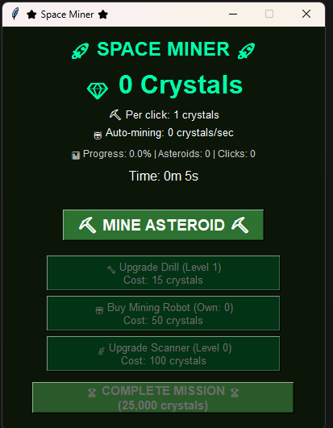

# Space Miner 🚀

A simple "idle clicker" game built with Python, based on an MVC (Model-View-Controller) architecture. The goal is to mine asteroids, collect crystals, and complete the final mission.



## Features

* **Manual Mining:** Click the "MINE ASTEROID" button to collect crystals.
* **Idle Mining:** Buy "Mining Robots" to automatically generate crystals per second.
* **Upgrades:**
    * **Upgrade Drill:** Increases the number of crystals earned per click.
    * **Buy Mining Robot:** Increases the passive crystals/second rate.
    * **Upgrade Scanner:** (Puedes añadir aquí lo que hace esta mejora)
* **Game Goal:** Reach 25,000 crystals to "COMPLETE MISSION".
* **Progress Tracking:** The UI shows total crystals, per-click rate, auto-mining rate, and time played.

## Technologies Used

* **Python 3**
* **[Añade aquí tu librería gráfica]**: (p.ej., `Tkinter` para la GUI)
* **MVC Architecture**

## Project Structure

The project follows a Model-View-Controller (MVC) pattern to separate logic from the user interface:

* `Main.py`: The main entry point of the application. It initializes and connects the Model, View, and Controller.
* `GameModel.py`: Contains all the game's data and business logic. It manages the state (e.g., `crystals`, `per_click_value`, `auto_mining_rate`, upgrade costs) and performs all calculations.
* `GameView.py`: Manages the entire graphical user interface (GUI). It builds the window, buttons, and labels, and is responsible for *displaying* the data from the Model.
* `GameController.py`: Acts as the bridge between the Model and the View. It handles all user input (like button clicks) and tells the Model to update its state, or tells the View to update its display.

## How to Run

1.  Ensure you have Python 3 installed.
2.  (If needed) Install dependencies:
    ```bash
    pip install -r requirements.txt 
    ```
    *(Nota: Si no tienes un `requirements.txt`, puedes borrar esta sección o crear uno con `pip freeze > requirements.txt`)*
3.  Run the main file from the terminal:
    ```bash
    python Main.py
    ```
